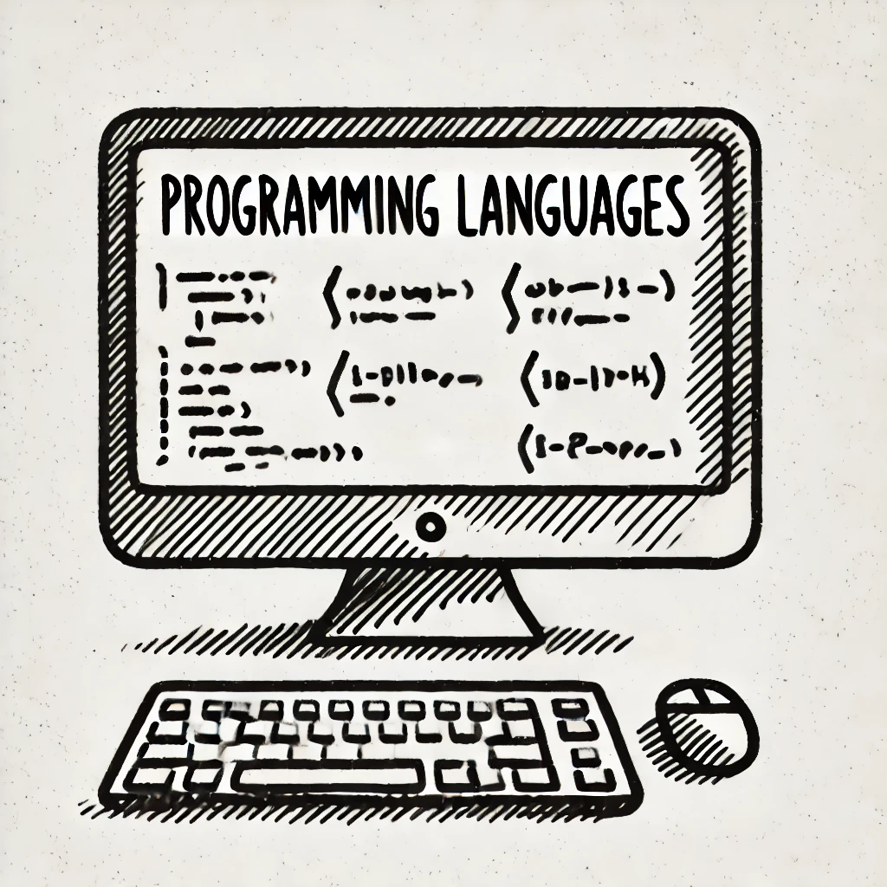

# A Beginner's Guide to HTML, CSS, and Programming Languages
Understanding **HTML, CSS, and programming languages** is essential for anyone interested in web development, software engineering, or mobile app development. This guide compiles useful learning resources and cheat sheets for various languages, including **HTML, CSS, Swift, Android development, Java, C#, Ruby, PHP, and C++**.

## 📌 HTML & CSS: The Foundation of Web Development
### **Learn HTML & CSS**
- [HTML Tutorial - Tutorial Republic](https://www.tutorialrepublic.com/html-tutorial/)
- [HTML5 Cheat Sheet - WPKube](https://www.wpkube.com/html5-cheat-sheet/)
- [HTML & CSS Fundamentals - W3C & edX](https://www.edx.org/learn/css/the-world-wide-web-consortium-w3c-html5-and-css-fundamentals)

### **Cheat Sheets & Best Practices**
- [CSS Cheat Sheet - HTML Cheat Sheet](https://htmlcheatsheet.com/css/)
- [Best HTML & CSS Cheat Sheets - ShareThis](https://sharethis.com/best-practices/2020/02/best-html-and-css-cheat-sheets/)

## 📌 Swift: Apple's Programming Language
### **Learn Swift**
- [Swift.org - Official Swift Site](https://www.swift.org/about/)
- [Apple Developer - Swift Documentation](https://developer.apple.com/swift/)
- [Swift Resources & Learning](https://developer.apple.com/swift/resources/)

## 📌 Android Development: Building Mobile Apps
### **Learn Android Development**
- [Guide to Android App Development - Android Authority](https://www.androidauthority.com/develop-android-apps-languages-learn-391008/)
- [Android Developer Studio](https://developer.android.com/studio)
- [Build Your First Android App - Google CodeLabs](https://developer.android.com/codelabs/build-your-first-android-app#1)

### **Java for Android Development**
- [Java for Beginners - Android Authority](https://www.androidauthority.com/java-tutorial-for-beginners-write-a-simple-app-with-no-previous-experience-1121975/)

## 📌 C# & .NET Development
### **Learn C# & .NET**
- [Learn C# - Microsoft](https://dotnet.microsoft.com/en-us/learn/csharp)
- [MAUI for Multi-Platform Apps](https://dotnet.microsoft.com/en-us/learn/maui)

## 📌 Java: The Versatile Language
### **Learn Java**
- [Oracle Java Tutorials](https://docs.oracle.com/javase/tutorial/)
- [Java for Beginners - Home and Learn](https://www.homeandlearn.co.uk/java/java.html)

## 📌 Ruby: Dynamic Programming Language
### **Learn Ruby**
- [Ruby Documentation](https://ruby-doc.org/)
- [Ruby Programming Language - Official Site](https://www.ruby-lang.org/en/documentation/)
- [Programming Ruby Guide](https://ruby-doc.com/docs/ProgrammingRuby/)
- [Codecademy Ruby Course](https://www.codecademy.com/learn/learn-ruby)

## 📌 PHP: Server-Side Scripting
### **Learn PHP**
- [Official PHP Site](https://www.php.net/)
- [PHP The Right Way](https://phptherightway.com/)
- [PHP Online Learning](https://www.learn-php.org/)

## 📌 C++: High-Performance Programming
### **Learn C++**
- [Microsoft C++ Learning Hub](https://learn.microsoft.com/en-us/cpp/?view=msvc-160)
- [Microsoft C++ Samples](https://learn.microsoft.com/en-us/samples/browse/?languages=cpp&terms=gaming)
- [Learn C++ - Online Tutorial](https://www.learn-cpp.org/)

## ✅ Conclusion
This guide provides a comprehensive list of resources for **learning HTML, CSS, Swift, Android development, Java, C#, Ruby, PHP, and C++**. Whether you're a **beginner or an advanced programmer**, these websites, tutorials, and cheat sheets will help you **enhance your programming skills**.

📌 *Happy Coding!*
